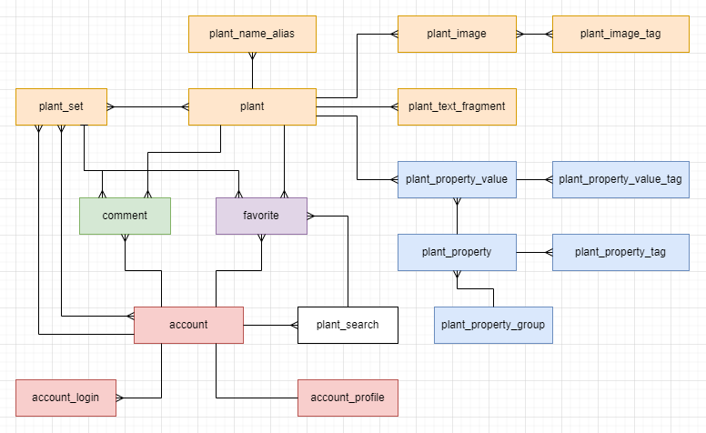

This is a "second final" :) version of SEED storage which was designed in PostgreSQL.

> __Q__: Why all entities are placed in one relational database?
> 
> __A__: It is a pet project for one developer
> 1. Reducing the complexity of the solution
> 2. Documentation and strict data schema which reduces the number of errors and reduces the time to remember what I did

# PostgreSQL entities

- accounts
- plants & plant-sets
- plant properties
- favorites for plants & plant-sets
- comments for plants & plant-sets

### seed_core_db concept

